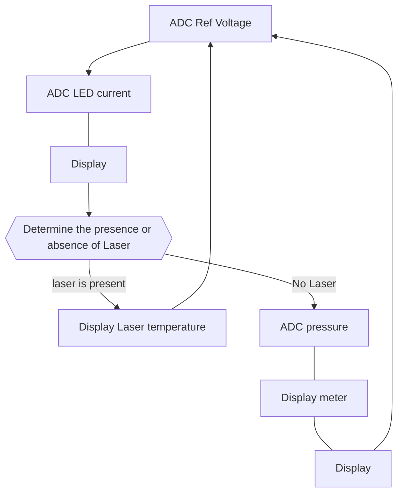

# CPnP_Z test
4CompactPnP

The ADC of this PIC is designed to be full scale with the supply voltage; the PIC has a reference voltage FVR=2.048V. Calculate that value backwards to find the Vdd voltage; ; once Vdd is known, we can AD convert the correct current and barometric pressure values. The temperature of the laser can be known via serial communication. When the laser is mounted, the temperature of the laser is displayed without pressure measurement.

