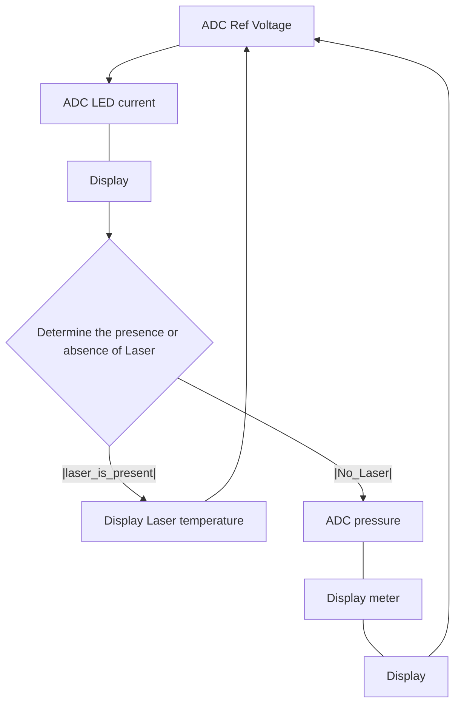

# CPnP_Z test
4CompactPnP

The ADC of this PIC is designed to be full scale with the supply voltage. 2.048V reference voltage is used as ADC. From that value, the voltage at full scale is obtained by backward calculation.

