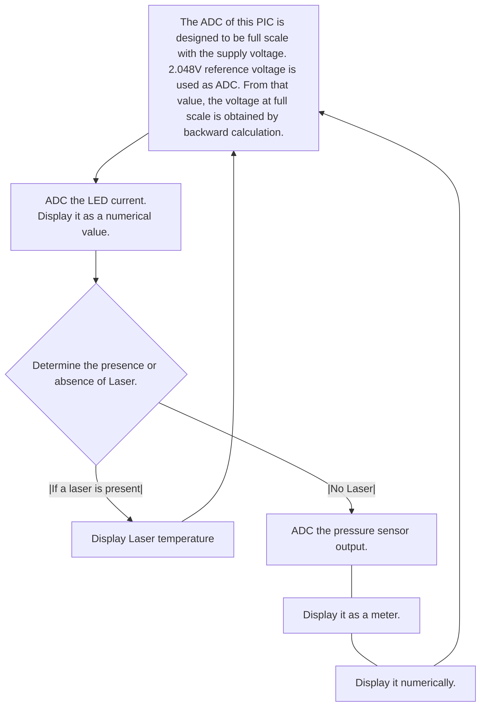

# CPnP_Z test
4CompactPnP

```mermaid
graph TD;
    A[The ADC of this PIC is designed to be full scale with the supply voltage. 2.048V reference voltage is used as ADC. From that value, the voltage at full scale is obtained by backward calculation.]-->B[ADC the LED current.
Display it as a numerical value.];
    B-->C{Determine the presence or absence of Laser.};
    C--|If a laser is present|-->D;
    C--|No Laser|-->E;
    D[Display Laser temperature];
    E[ADC the pressure sensor output.]---F[Display it as a meter.];
    F---G[Display it numerically.];
    G-->A;
    D-->A;
```
